Supervised Learning Techniques Course Project
================
Leonid Shpaner - January 1, 2023

``` r
# function for loading necessary libraries and installing them if they have not
# yet been installed

pack <- function(lib){

     new.lib <- lib[!(lib %in% 
                     installed.packages()[, 'Package'])]
   if (length(new.lib)) 
      install.packages(new.lib, dependencies = TRUE)
   sapply(lib, require, character.only = TRUE)

   }

packages <- c('partykit', 'e1071', 'caret', 'corrplot', 'MASS', 'car', 'DT', 
              'ggplot2', 'cowplot', 'ggpubr', 'rms', 'pander', 'ROCR', 'pROC')

pack(packages) # run function
```

    ## partykit    e1071    caret corrplot     MASS      car       DT  ggplot2 
    ##     TRUE     TRUE     TRUE     TRUE     TRUE     TRUE     TRUE     TRUE 
    ##  cowplot   ggpubr      rms   pander     ROCR     pROC 
    ##     TRUE     TRUE     TRUE     TRUE     TRUE     TRUE

``` r
# set working directory by concatenating long string
string1 <- 'C:/Users/lshpaner/OneDrive/Cornell University/Coursework'
string2 <- '/Data Science Certificate Program/CEEM585 '
string3 <- '- Supervised Learning Techniques'

# concatenate each string
working_dir = paste(string1, string2, string3, sep = '')

# set the working directory by calling function
setwd(working_dir) 

# confirm working directory
getwd() 
```

\[1\] “C:/Users/lshpaner/OneDrive/Cornell University/Coursework/Data
Science Certificate Program/CEEM585 - Supervised Learning Techniques”

## Part One

### Building A Model

In this part of the project, you will focus on building a model to
understand who might make a good product technician if hired using
linear discriminate analysis logit and ordered logit modeling. The data
set you will be using is in the file `HRdata2groups.csv`, contained in
the RStudio instance.

<ol start="1">
<li>

The four performance scores in `PerfScore` have been mapped into two new
categories of Satisfactory and Unsatisfactory under the heading of
`CollapseScore`. Assume that levels 1 and 2 are unacceptable and levels
3 and 4 are acceptable. Build a linear discriminant analysis using
regression with these two categories as the dependent variable. The
purpose of this question is for you to examine the independent variables
and conclude which one to include in the regression model. Several are
not useful. Remember that when we do this, only the coefficients in the
model are useful. You may use the function `lm()` which has the syntax
`lm(dependent variable ~ independent variable 1+ independent variable 2+…, data=frame)`.
This function is part of the package caret: hence you will need to use
the command `library(caret)`.

Notice that you have a several variables that might be used as
independent variables. You should pick the variables to include based on
how effective they are at explaining the variability in the dependent
variable as well as which variables might be available should you need
to use this model to determine if a candidate is likely to make a good
employee. You may assume that the verbal and mechanical scores will be
available at the point where a decision about hiring is to be made. In
this question, please give us the linear discriminate model you have
developed.
</li>

<font color="blue"> The dataset is inspected and the categorical classes
of <font color="black"> `Acceptable` </font> and <font color="black">
`Unacceptable` </font> are cast to the Performance Score
(<font color="black"> `PerfScoreID` </font>) in a new column named
<font color="black"> `CollapseScore` </font>. However, since supervised
learning models need to learn from a numerical, though, binarized target
column, a new column of <font color="black"> `Score` </font> is thus
created. Extraneous or otherwise not useful columns like
<font color="black"> `Employee ID` </font>, <font color="black">
`CollapseScore` </font>, and <font color="black"> `Score` </font> are
removed such that a numerical only dataframe is created for subsequent
distribution analysis. </font> </font>

``` r
# read in the data
hr_data <- read.csv('HRdata2groups.csv')

# Adding column based on other column:
# inspect first five rows of the dataset
pandoc.table(head(hr_data), style = 'simple', split.table = Inf) 
```

| EmpID | Termd | EmpStatusID | PerfScoreID | EmpSatisfaction | MechanicalApt | VerbalApt |
|:-----:|:-----:|:-----------:|:-----------:|:---------------:|:-------------:|:---------:|
|   1   |   0   |      1      |      4      |        5        |     174.6     |   187.2   |
|   2   |   0   |      1      |      3      |        3        |     110.6     |   102.7   |
|   3   |   1   |      5      |      3      |        4        |     148.6     |   156.1   |
|   4   |   0   |      1      |      1      |        2        |     49.11     |   44.86   |
|   5   |   0   |      1      |      1      |        5        |     42.15     |   41.59   |
|   6   |   0   |      1      |      4      |        4        |      133      |   130.2   |

``` r
# cast categorical classes to Performance Score 
hr_data$CollapseScore <- ifelse(hr_data$PerfScoreID >= 3, 'Acceptable', 
                                                          'Unacceptable')
# numerically binarize these performance scores
hr_data$Score <- ifelse(hr_data$CollapseScore == 'Acceptable', 1, 0)
pandoc.table(head(hr_data), style = 'simple')
```

| EmpID | Termd | EmpStatusID | PerfScoreID | EmpSatisfaction | MechanicalApt |
|:-----:|:-----:|:-----------:|:-----------:|:---------------:|:-------------:|
|   1   |   0   |      1      |      4      |        5        |     174.6     |
|   2   |   0   |      1      |      3      |        3        |     110.6     |
|   3   |   1   |      5      |      3      |        4        |     148.6     |
|   4   |   0   |      1      |      1      |        2        |     49.11     |
|   5   |   0   |      1      |      1      |        5        |     42.15     |
|   6   |   0   |      1      |      4      |        4        |      133      |

Table continues below

| VerbalApt | CollapseScore | Score |
|:---------:|:-------------:|:-----:|
|   187.2   |  Acceptable   |   1   |
|   102.7   |  Acceptable   |   1   |
|   156.1   |  Acceptable   |   1   |
|   44.86   | Unacceptable  |   0   |
|   41.59   | Unacceptable  |   0   |
|   130.2   |  Acceptable   |   1   |

``` r
# extract meaningful data (i.e., remove categorical data types)
hr_data_numeric <- subset(hr_data, select = -c(EmpID, CollapseScore, Score))
```

<font color="blue"> The histogram distributions below do not yield or
uncover any near-zero-variance predictors, but it is worth noting that
<font color="black"> `Termd` </font> has only two class labels.
<font color="black"> `MechanicalApt` </font> and <font color="black">
`VerbalApt` </font> exhibit normality; other variables approach the same
trend. </font>

``` r
# create function for plotting histograms to check for near-zero variance 
# in distributions where input `df` is a dataframe of interest
nearzerohist <- function(df, x, y) {
  
   # x rows by y columns & adjust margins
   par(mfrow = c(x, y), mar = c(4, 4, 4, 0)) 
   for (i in 1:ncol(df)){
     hist(df[, i], 
          xlab = names(df[i]), 
          main = paste(names(df[i]), ''), 
          col = 'gray18')
   }  
  
   # check for near zero variance predictors using if-else statement
   nearzero_names <- nearZeroVar(df)  
   if (length(nearzero_names) == 0) {
      print('There are no near-zero variance predictors.')
   } else {
     cat('The following near-zero variance predictors exist:', 
     print(nearzero_names))
   }
}
```

``` r
# call the `nearzerohist()` function
nearzerohist(hr_data_numeric, x = 2, y = 3) 
```

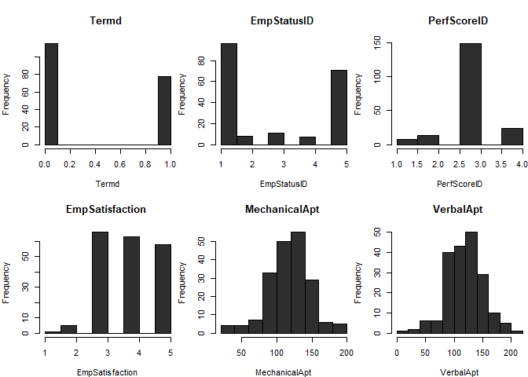

    ## [1] "There are no near-zero variance predictors."

<font color="blue"> Examining the <font color="black"> `Score` </font>
column separately yields an imbalanced dataset where 172
<font color="black"> `Acceptable` </font> cases outweigh the 21
<font color="black"> `Unacceptable` </font> classes. However, no
solution is rendered for this outcome. The data is treated as-is.
</font>

``` r
# function for generating class balance table and barplot
# inputs -->   feat: feature or column of interest
#              title: plot title
#                 x: x-axis label
#                 y: y-axis label

class_balance <- function(feat, title, x, y) {
  
   # check target column's class balance
   # parse target variable into table showcasing class distribution
   feat_table <- table(unname(feat)) # generate table for column
   
   # fix plot margins
   par(mfrow = c(1, 1)) # fix plotting space from prior graph
   par(mar = c (2, 2, 2, 1)) 
      # plot the counts (values) of each respective class on barplot
   barplot(feat_table, main = title, space = c(0), horiz = FALSE,
           names.arg = c(x, y), 
           col = c('cornflowerblue', 'brown2'))
    
   return (feat_table)
    
}
```

``` r
class_balance(feat = hr_data$CollapseScore, title = 'HR by Class', 
                 x = 'Acceptable', y = 'Unacceptable')
```

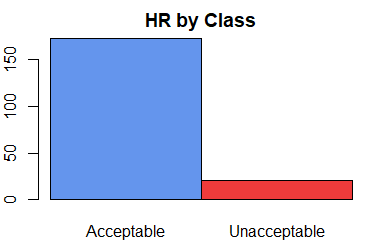

    ## 
    ##   Acceptable Unacceptable 
    ##          172           21

<li>
Explain the variables you decided to use in the model described above
and why.
</li>

<font color="blue"> The employee’s hiring status <font color="black">
`EmpStatusID` </font> in conjunction with the employee’s satisfaction
<font color="black"> `EmpSatisfaction` </font> and average aptitude
score were used in the model. </font>

<font color="blue"> Averaging the mechanical and verbal scores row over
row creates a new <font color="black"> `Aptitude` </font> column with
these values. Mechanical and verbal aptitude scores are omitted because
of their high between-predictor relationships. <font color="black">
`MechanicalApt` </font> vs. <font color="black"> `VerbalApt` </font>
yields an *r* = 0.96. Once the scores are averaged and passed into one
column, the problem of multicollinearity is removed.
<font color="black"> `Termd` </font> is also omitted because its
correlation with <font color="black"> `EmpStatusID` </font> is *r* =
0.96. </font>

``` r
# create function to plot correlation matrix and establish multicollinearity
# takes one input (df) to pass in dataframe of interest
multicollinearity <- function(df) {
  
      # Examine between predictor correlations/multicollinearity
      corr_data <- df # select only independent var.
      corr <- cor(corr_data)
      corrplot(corr, mar = c(0, 0, 0, 0), method = 'color', 
                     col = colorRampPalette(c('#FC0320', '#FFFFFF', 
                                              '#FF0000'))(100), 
                     addCoef.col = 'black', tl.srt = 45, tl.col = 'black', 
                     type = 'lower')
      
      # assign variable to count how many highly correlated
      # variables there exist based on 0.75 threshold
      highCorr <- findCorrelation(corr, cutoff = 0.75)
      
      # find correlated names
      highCorr_names <- findCorrelation(corr, cutoff = 0.75, names = TRUE)
      cat(' The following variables should be omitted:',  
      paste('\n', unlist(highCorr_names)))
    
}      
```

``` r
# determine multicollinearity
multicollinearity(hr_data[c(1:7)])
```

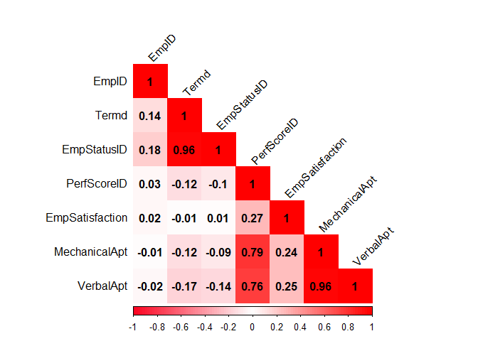

    ##  The following variables should be omitted: 
    ##  VerbalApt 
    ##  MechanicalApt 
    ##  Termd

<font color="blue"> Variance Inflation Factor (VIF) scores confirm
similar behavior, exhibiting high multicollinearity once a threshold of
five is reached and surpassed. A linear model (lm) is used to test this
behavior. </font>

``` r
# use generalized linear model to determine confirm multicollinearity w/ VIF
model_all <- lm(Score ~ . - CollapseScore, data = hr_data) # remove CollapseScore 
                                                           # since it is target
# and we are only interested in comparing between-predictor relationships

# use car library to extract VIF and parse it into a pandoc table using the 
# linear model as a proxy for analysis
pandoc.table(vif(model_all), style = 'simple', split.table = Inf)
```

| EmpID | Termd | EmpStatusID | PerfScoreID | EmpSatisfaction | MechanicalApt | VerbalApt |
|:-----:|:-----:|:-----------:|:-----------:|:---------------:|:-------------:|:---------:|
| 1.058 | 13.74 |    13.93    |    2.785    |      1.096      |     15.91     |   13.94   |

``` r
# create vector of VIF values for plotting
vif_values <- vif(model_all) 

par(mar = c(7.5, 2, 1, 1)) # fix plot margins
# create column chart to display each VIF value
barplot(vif_values, main = 'VIF Values', horiz = FALSE, col = 'steelblue', 
        las = 2) 

# add vertical line at 5 as after 5 there is severe correlation
abline(h = 5, lwd = 3, lty = 2)   
```

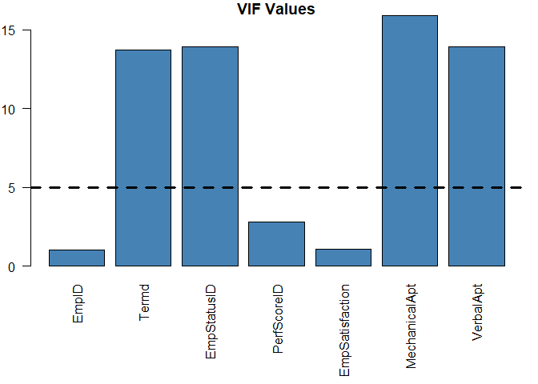

``` r
# create average score since result of both scores creates multicollinearity
hr_data$Aptitude <- rowMeans(hr_data[, c(6, 7)], na.rm = TRUE) 

# create a final dataframe with selected columns of interest for modeling
hr_data_final <- hr_data[, c(3, 5, 8, 9, 10)]
```

``` r
# Re-examine between predictor correlations/multicollinearity
highCorr <- findCorrelation(cor(hr_data_final[c(1, 2, 5)]), cutoff = 0.75, 
                            names = TRUE)
cat(' The following variables should be omitted:',   
paste('\n', unlist(highCorr)))
```

    ##  The following variables should be omitted: 
    ## 

<font color="blue"> The Score vs. Aptitude scatterplot below exhibits a
moderate correlation of *r* = 0.62. Employee satisfaction exhibits a
much weaker relationship of *r* = 0.26, and there is almost no
relationship between Score and Employee Status ID where *r* = -0.067.
</font>

``` r
# create function for plotting correlations between variables  
# inputs: xvar: independent variable, yvar: dependent variable, 
#         title: plot title, xlab: x-axis label, ylab: y-axis label
correl_plot <- function(df, xvar, yvar, title, xlab, ylab) {
  
   ggplot(df, aes(x = xvar, y = yvar))+
   ggtitle(title) +
   xlab(xlab) + ylab(ylab) +
   geom_point(pch = 1) + ylim(0, 1.25) +
   geom_smooth(method = 'lm', se = FALSE)+
   theme_classic() +
   stat_cor(method = 'pearson', label.x = 0.15, label.y = 0.20) # correl coeff. 
  
}
```

``` r
# create three correlation plots on same grid
plot1 <- correl_plot(hr_data_final, xvar = hr_data_final$EmpStatusID, 
                     yvar = hr_data_final$Score, title = 'Score vs. EmpStatusID', 
                     xlab = 'EmpStatusID', ylab = 'Score')

plot2 <- correl_plot(hr_data_final, xvar = hr_data_final$EmpSatisfaction, 
                     yvar = hr_data_final$Score, 
                     title = 'Score vs. EmpSatisfaction', 
                     xlab = 'EmpSatisfaction', ylab = 'Score')

plot3 <- correl_plot(hr_data_final, xvar = hr_data_final$Aptitude,
                     yvar = hr_data_final$Score, title = 'Score vs. Aptitude',
                     xlab = 'Aptitude', ylab = 'Score')

# plot all correlations together
plot_grid(plot1, plot2, plot3, labels = 'AUTO', ncol = 3, align = '')
```

    ## `geom_smooth()` using formula = 'y ~ x'
    ## `geom_smooth()` using formula = 'y ~ x'
    ## `geom_smooth()` using formula = 'y ~ x'

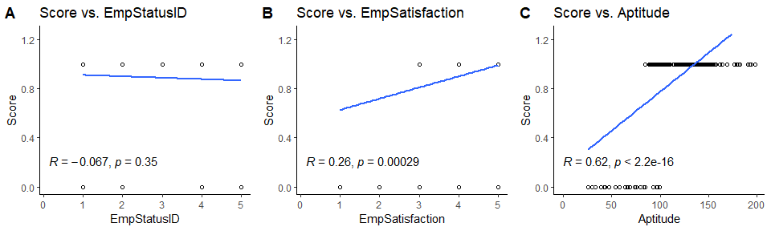
<font color="blue"> Fitting the linear discriminant analysis model
produces the following results. </font>

``` r
par(mar = c(4, 2, 0, 0)) # fix plot margins
# Fit the Linear Discriminant Analysis (LDA) model
lda_fit <- lda(Score ~  EmpStatusID + EmpSatisfaction + Aptitude, 
               data = hr_data_final); lda_fit
```

    ## Call:
    ## lda(Score ~ EmpStatusID + EmpSatisfaction + Aptitude, data = hr_data_final)
    ## 
    ## Prior probabilities of groups:
    ##         0         1 
    ## 0.1088083 0.8911917 
    ## 
    ## Group means:
    ##   EmpStatusID EmpSatisfaction  Aptitude
    ## 0    3.095238        3.238095  64.41122
    ## 1    2.691860        3.970930 124.64620
    ## 
    ## Coefficients of linear discriminants:
    ##                        LD1
    ## EmpStatusID     0.00271593
    ## EmpSatisfaction 0.25572719
    ## Aptitude        0.03966111

``` r
plot(lda_fit) # plot the lda model
```


<li>

The regression model can be used to classify each of the individuals in
the dataset. As discussed in the videos, you will need to find the
cutoff value for the regression value that separates the unsatisfactory
performers from the satisfactory performers. Find this value and
determine whether individual 5 is predicted to be satisfactory or not.

In R you can use the predict command to use the regression function with
the data associated with each individual in the dataset. For example:
`pred=predict(model, frame)` stores the predicted values from the
regression function into the variable pred when the regression model has
been assigned to the variable model as in this statement:
`model <-lm(dependent variable ~ independent variable 1+ independent variable 2+…, data=frame).`

You may then find the mean value of the regression for all observations
of unsatisfactory employees using the command
`meanunsat=mean(pred[frame$CollapseScore==0])`.

The cutoff value is then computed in r as follows:
`cutoff<-0.5(meanunsat+meansat)`.

If you want to compare what your model says verses whether they were
found to be satisfactory or unsatisfactory you may add the prediction to
the data frame using `cbind(frame, pred)`. This will make the
predictions part of the dataset.
</li>

<br>

<font color="blue"> A generalized linear model is fitted accordingly, a
column of predictions is appended to the dataframe, and a cutoff value
is determined accordingly. Individual 5 has unacceptable/unsatisfactory
performance, and the model predicts the same with a probability of
0.471, which is below the cutoff of 0.737. </font>

``` r
# Fit a regression model
reg_model <- lm(Score ~ EmpStatusID + EmpSatisfaction + Aptitude, 
                data = hr_data_final)

# stores the predicted values from the regression function into the variable 
# pred when the regression model has been assigned to the variable reg_model  
pred <- predict(reg_model, hr_data_final) 

# find the mean value of the regression for all observations of unsatisfactory 
# and satisfactory employees
meanunsat <- mean(pred[hr_data_final$Score == 0]) 
meansat <- mean(pred[hr_data_final$Score == 1]) 
cat(' Mean of Satisfactory Results =', meansat, '\n', 
    'Mean of Unsatisfactory Results =', meanunsat, '\n')
```

Mean of Satisfactory Results = 0.9340495 Mean of Unsatisfactory Results
= 0.540166

``` r
# determine the cutoff value
cutoff <- 0.5*(meanunsat + meansat)
cat(' Cutoff Value =', cutoff)
```

Cutoff Value = 0.7371078

``` r
cbind_hrdatafinal <- cbind(hr_data_final, pred)
pandoc.table(head(cbind_hrdatafinal), style = 'simple', split.table = Inf)
```

| EmpStatusID | EmpSatisfaction | CollapseScore | Score | Aptitude |  pred  |
|:-----------:|:---------------:|:-------------:|:-----:|:--------:|:------:|
|      1      |        5        |  Acceptable   |   1   |  180.9   | 1.315  |
|      1      |        3        |  Acceptable   |   1   |  106.7   | 0.7863 |
|      5      |        4        |  Acceptable   |   1   |  152.3   | 1.104  |
|      1      |        2        | Unacceptable  |   0   |  46.99   | 0.3852 |
|      1      |        5        | Unacceptable  |   0   |  41.87   | 0.4715 |
|      1      |        4        |  Acceptable   |   1   |  131.6   | 0.9764 |

4.  Construct a logit model using the two performance groups. Compare
    this model and the discriminant analysis done in step 1. To
    construct the logit model, use the function `lrm()` in the library
    rms.

``` r
# Construct a logit model using the two performance groups
logit <- lrm(Score ~ MechanicalApt + VerbalApt, data = hr_data); logit
```

    ## Logistic Regression Model
    ##  
    ##  lrm(formula = Score ~ MechanicalApt + VerbalApt, data = hr_data)
    ##  
    ##                         Model Likelihood     Discrimination    Rank Discrim.    
    ##                               Ratio Test            Indexes          Indexes    
    ##  Obs           193    LR chi2     109.40     R2       0.870    C       0.991    
    ##   0             21    d.f.             2     R2(2,193)0.427    Dxy     0.983    
    ##   1            172    Pr(> chi2) <0.0001    R2(2,56.1)0.852    gamma   0.983    
    ##  max |deriv| 3e-06                           Brier    0.017    tau-a   0.192    
    ##  
    ##                Coef     S.E.    Wald Z Pr(>|Z|)
    ##  Intercept     -33.7121 11.5108 -2.93  0.0034  
    ##  MechanicalApt   0.4697  0.1689  2.78  0.0054  
    ##  VerbalApt      -0.0865  0.0743 -1.16  0.2443  
    ## 

<font color="blue"> The linear discriminant analysis model does not use
mechanical aptitude and/or verbal aptitude as standalone independent
variables. The scores are averaged to create one column for general
aptitude. </font>

<li>
Build an ordered logit model for the full four categories for
performance. When you call the function `lrm()` you will use the
original categories `PerScoreID`. What is the probability that
individual two is in each of the four performance categories? You can
use the function `predict()` to do this. The form of the call is
`predict(name of the model you used when you created the model, data=frame, type=”fitted.ind”)`
</li>

<br>

``` r
# Build an ordered logit model for the full four categories for performance
ologit <- lrm(PerfScoreID ~ Termd + EmpStatusID + EmpSatisfaction, data = hr_data)
ologit
```

    ## Logistic Regression Model
    ##  
    ##  lrm(formula = PerfScoreID ~ Termd + EmpStatusID + EmpSatisfaction, 
    ##      data = hr_data)
    ##  
    ##  
    ##  Frequencies of Responses
    ##  
    ##    1   2   3   4 
    ##    8  13 148  24 
    ##  
    ##                        Model Likelihood      Discrimination    Rank Discrim.    
    ##                              Ratio Test             Indexes          Indexes    
    ##  Obs           193    LR chi2     12.13      R2       0.077    C       0.634    
    ##  max |deriv| 8e-09    d.f.            3      R2(3,193)0.046    Dxy     0.268    
    ##                       Pr(> chi2) 0.0070    R2(3,105.5)0.083    gamma   0.298    
    ##                                              Brier    0.086    tau-a   0.105    
    ##  
    ##                  Coef    S.E.   Wald Z Pr(>|Z|)
    ##  y>=2             1.0880 0.9065  1.20  0.2300  
    ##  y>=3            -0.0130 0.8869 -0.01  0.9883  
    ##  y>=4            -4.3212 0.9741 -4.44  <0.0001 
    ##  Termd           -1.2239 1.1992 -1.02  0.3075  
    ##  EmpStatusID      0.1560 0.3152  0.49  0.6208  
    ##  EmpSatisfaction  0.5872 0.2086  2.81  0.0049  
    ## 

``` r
# probability that individual two is in each of the four performance categories
pred_ologit <- predict(ologit, data = hr_data, type = 'fitted.ind')
```

``` r
# inspect the dataframe
pandoc.table(head(pred_ologit), style = 'simple', split.table = Inf, round = 4) 
```

| PerfScoreID=1 | PerfScoreID=2 | PerfScoreID=3 | PerfScoreID=4 |
|:-------------:|:-------------:|:-------------:|:-------------:|
|    0.0151     |    0.0289     |    0.7297     |    0.2263     |
|    0.0472     |    0.0824     |    0.7875     |    0.0829     |
|    0.0477     |    0.0833     |     0.787     |    0.0819     |
|    0.0818     |    0.1295     |    0.7409     |    0.0478     |
|    0.0151     |    0.0289     |    0.7297     |    0.2263     |
|    0.0268     |    0.0496     |    0.7837     |    0.1399     |

``` r
# get predictions only for second individual
individual2 <- pred_ologit[2, ]; cat('\n') 
```

``` r
par(mar = c(4, 4, 1, 1)) # fix plot margins
plot(individual2, type = 'l', main = 'Predictions for Individual 2', 
     xlab = 'Category', ylab = 'Probability')
```

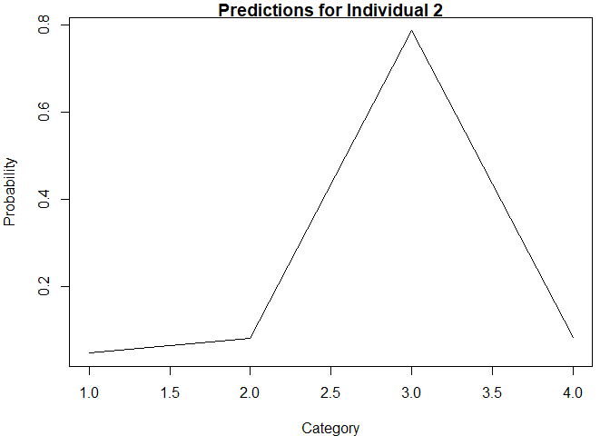

``` r
pandoc.table(individual2, style = 'simple', split.table = Inf, round = 4)
```

| PerfScoreID=1 | PerfScoreID=2 | PerfScoreID=3 | PerfScoreID=4 |
|:-------------:|:-------------:|:-------------:|:-------------:|
|    0.0472     |    0.0824     |    0.7875     |    0.0829     |

</ol>

<br> <font color="blue"> The respective probabilities that individual
two will be in each of the four performance categories are 0.0471702,
0.0824139, 0.7875144, 0.0829015. </font>

## Part Two

### Using Naïve Bayes to Predict a Performance Score

In this part of the project, you will use Naïve Bayes to predict a
performance score. This part continues the scenario from Part One and
uses the same modified version of the human resources data set available
on the Kaggle website. The data set you will be using is in the file
`NaiveBayesHW.csv` file. Over the course of this project, your task is
to gain insight into who might be a “high” performer if hired.

<ol start="1">
<li>
Using only the mechanical aptitude score, use Naïve Bayes to predict the
performance score for each employee. Professor Nozick discretized the
mechanical scores into four classes. Notice only three of four classes
have observations. This discretization is in the data file
`NaiveBayesHW.csv`. The function to create the model is `naiveBayes()`
</li>

<br>

``` r
naive_df <- read.csv('NaiveBayesHW.csv') # read in the dataset

# inspect the dataset
pandoc.table(head(naive_df), style = 'simple', split.table = Inf) 
```

| EmpID | Termd | EmpStatusID | PerfScoreID | EmpSatisfaction | PerfScore | MechanicalApt |
|:-----:|:-----:|:-----------:|:-----------:|:---------------:|:---------:|:-------------:|
|   1   |   0   |      1      |      4      |        5        |  Class4   |    Level4     |
|   2   |   0   |      1      |      3      |        3        |  Class3   |    Level3     |
|   3   |   1   |      5      |      3      |        4        |  Class3   |    Level4     |
|   4   |   0   |      1      |      1      |        2        |  Class1   |    Level1     |
|   5   |   0   |      1      |      1      |        5        |  Class1   |    Level1     |
|   6   |   0   |      1      |      4      |        4        |  Class4   |    Level3     |

``` r
# assign the naivebayes function to a new variable
nbmodel <- naiveBayes(PerfScore ~ MechanicalApt, data = naive_df)
print(nbmodel)
```

    ## 
    ## Naive Bayes Classifier for Discrete Predictors
    ## 
    ## Call:
    ## naiveBayes.default(x = X, y = Y, laplace = laplace)
    ## 
    ## A-priori probabilities:
    ## Y
    ##     Class1     Class2     Class3     Class4 
    ## 0.04145078 0.06735751 0.76683938 0.12435233 
    ## 
    ## Conditional probabilities:
    ##         MechanicalApt
    ## Y           Level1    Level3    Level4
    ##   Class1 1.0000000 0.0000000 0.0000000
    ##   Class2 0.0000000 0.0000000 1.0000000
    ##   Class3 0.0000000 0.6554054 0.3445946
    ##   Class4 0.0000000 0.3333333 0.6666667

``` r
# predict the naive bayes model
# type = raw' specifies that R should return the probability that a point is in 
# each risk group. Not specifying a type would print the most likely category 
# that each point would fall into. 

pred_bayes <- predict(nbmodel, naive_df, type = 'raw')  
head(pred_bayes, 20) # inspect the first 10 rows
```

    ##             Class1       Class2     Class3      Class4
    ##  [1,] 9.999000e-05 0.1624837516 0.63743626 0.199980002
    ##  [2,] 7.617524e-05 0.0001237848 0.92362480 0.076175241
    ##  [3,] 9.999000e-05 0.1624837516 0.63743626 0.199980002
    ##  [4,] 9.773977e-01 0.0015882712 0.01808186 0.002932193
    ##  [5,] 9.773977e-01 0.0015882712 0.01808186 0.002932193
    ##  [6,] 7.617524e-05 0.0001237848 0.92362480 0.076175241
    ##  [7,] 7.617524e-05 0.0001237848 0.92362480 0.076175241
    ##  [8,] 7.617524e-05 0.0001237848 0.92362480 0.076175241
    ##  [9,] 9.999000e-05 0.1624837516 0.63743626 0.199980002
    ## [10,] 9.999000e-05 0.1624837516 0.63743626 0.199980002
    ## [11,] 7.617524e-05 0.0001237848 0.92362480 0.076175241
    ## [12,] 7.617524e-05 0.0001237848 0.92362480 0.076175241
    ## [13,] 9.999000e-05 0.1624837516 0.63743626 0.199980002
    ## [14,] 7.617524e-05 0.0001237848 0.92362480 0.076175241
    ## [15,] 9.999000e-05 0.1624837516 0.63743626 0.199980002
    ## [16,] 9.999000e-05 0.1624837516 0.63743626 0.199980002
    ## [17,] 9.999000e-05 0.1624837516 0.63743626 0.199980002
    ## [18,] 9.999000e-05 0.1624837516 0.63743626 0.199980002
    ## [19,] 9.999000e-05 0.1624837516 0.63743626 0.199980002
    ## [20,] 9.999000e-05 0.1624837516 0.63743626 0.199980002

<li>
Using this modeling approach, what is your assessment of the probability
that individual 10 will evolve into each of the four probability classes
if hired? This can be done using the model created above and the
`pred()` function. The arguments for that function are the model name,
data and for type use “raw”. This question is parallel to the Practice
using Naïve Bayes activity you completed in R.
</li>

<br>

<font color="blue"> The probability that individual 10 will evolve into
each of the four probability classes if hired is as follows: </font>

``` r
# table the probabilities of each respective class for the individual
# get the 10th row only
individual10 <- pred_bayes[10, ] 
# assign to a dataframe
individual10 <- data.frame(individual10) 
# rename the column
colnames(individual10) <- c('Probability') 
# show the table
individual10 
```

    ##        Probability
    ## Class1  0.00009999
    ## Class2  0.16248375
    ## Class3  0.63743626
    ## Class4  0.19998000

</ol>

## Part Three

### Building Classification Trees

In this part of the project, you will build classification trees. This
part continues the scenario from Parts One and Two, as it uses the same
modified version of the human resources data set available on the Kaggle
website. Use the `HRdata4groups.csv` data set to predict each
individual’s performance (Performance Score ID) using classification
trees. In the space below, you will explain the model you have developed
and describe how well it performs.

<ol start="1">
<li>
In the space below, explain the model you developed. It is sufficient to
use the function `ctree()` in R to accomplish this in the style of the
codio exercise Practice: Building a Classification Tree in R—Small
Example.
</li>

<br>

``` r
hrdata_groups <- read.csv('HRdata4groups.csv') # read in the dataset

# inspect the first five rows of the dataset
pandoc.table(head(hrdata_groups, 5), style = 'simple') 
```

| EmpStatusID | PerfScoreID | CollapseScore | PayRate | Age | JobTenure |
|:-----------:|:-----------:|:-------------:|:-------:|:---:|:---------:|
|      1      |      4      |       1       |   23    | 43  |     8     |
|      1      |      3      |       1       |   16    | 50  |     8     |
|      5      |      3      |       1       |   21    | 37  |     9     |
|      1      |      1      |       0       |   20    | 53  |     6     |
|      1      |      1      |       0       |   18    | 31  |     5     |

Table continues below

| EngagementSurvey | EmpSatisfaction | MechanicalApt | VerbalApt |
|:----------------:|:---------------:|:-------------:|:---------:|
|        5         |        5        |     174.6     |   187.2   |
|        5         |        3        |     110.6     |   102.7   |
|        2         |        4        |     148.6     |   156.1   |
|       1.12       |        2        |     49.11     |   44.86   |
|       1.56       |        5        |     42.15     |   41.59   |

``` r
str(hrdata_groups) # print out the structure of the dataframe
```

    ## 'data.frame':    193 obs. of  10 variables:
    ##  $ EmpStatusID     : int  1 1 5 1 1 1 1 5 5 5 ...
    ##  $ PerfScoreID     : int  4 3 3 1 1 4 4 3 3 3 ...
    ##  $ CollapseScore   : int  1 1 1 0 0 1 1 1 1 1 ...
    ##  $ PayRate         : num  23 16 21 20 18 16 20 24 15 22 ...
    ##  $ Age             : int  43 50 37 53 31 40 46 50 48 37 ...
    ##  $ JobTenure       : int  8 8 9 6 5 6 6 9 8 7 ...
    ##  $ EngagementSurvey: num  5 5 2 1.12 1.56 3.39 4.76 3.49 3.08 3.18 ...
    ##  $ EmpSatisfaction : int  5 3 4 2 5 4 4 4 4 3 ...
    ##  $ MechanicalApt   : num  174.6 110.6 148.6 49.1 42.2 ...
    ##  $ VerbalApt       : num  187.2 102.7 156.1 44.9 41.6 ...

<font color="blue"> Before modeling can commence, it is important to
establish between-predictor relationships and the potential presence of
multicollinearity, because this is a refined dataset from a new .csv
file. The classification trees model is developed from all variables
except for mechanical aptitude and verbal aptitude. Verbal aptitude
exhibits a noticeably high correlation of *r* = 0.96 with mechanical
aptitude. However, rather than omitting this one variable, both aptitude
columns are replaced with a new column by the name of aptitude which has
been averaged from their results.

``` r
# Examine between predictor correlations/multicollinearity
highCorr <- findCorrelation(cor(hrdata_groups[c(-2)]), cutoff = 0.75, 
                            names = TRUE)
cat(' The following variables should be omitted: \n', paste(unlist(highCorr)))
```

    ##  The following variables should be omitted: 
    ##  VerbalApt

<font color="blue"> <font color="black"> `VerbalApt` </font> exhibits
multicollinearity, so it is averaged with <font color="black">
`MechanicalApt` </font>, just like in part one. A replacement column
called <font color="black"> Aptitude </font> is once again created on
this refined dataset. </font> </font>

``` r
# create aptitude from averaged MechanicalApt and VerbalApt scores
hrdata_groups$Aptitude <- rowMeans(hrdata_groups[, c(9, 10)], na.rm = TRUE)
# mechanical aptitude, and verbal aptitude are omitted
hrgroups_final <- hrdata_groups[, c(-9, -10)] # finalize dataframe for modeling
```

<font color="blue"> Between-predictor relationships are once again
re-examined to ensure no residual multicollinearity is detected. </font>

``` r
# Re-examine between predictor correlations/multicollinearity
highCorr <- findCorrelation(cor(hrgroups_final[, c(-2)]), cutoff = 0.75, 
                            names = TRUE)
cat(' The following variables should be omitted:', '\n',  
paste(unlist(highCorr)))
```

    ##  The following variables should be omitted: 
    ## 

``` r
# build the classification tree
ctout <- ctree(PerfScoreID ~ ., data = hrgroups_final) 
ctout 
```

    ## 
    ## Model formula:
    ## PerfScoreID ~ EmpStatusID + CollapseScore + PayRate + Age + JobTenure + 
    ##     EngagementSurvey + EmpSatisfaction + Aptitude
    ## 
    ## Fitted party:
    ## [1] root
    ## |   [2] CollapseScore <= 0
    ## |   |   [3] Aptitude <= 53.89066: 1.000 (n = 8, err = 0.0)
    ## |   |   [4] Aptitude > 53.89066: 2.000 (n = 13, err = 0.0)
    ## |   [5] CollapseScore > 0
    ## |   |   [6] Aptitude <= 154.50311: 3.052 (n = 154, err = 7.6)
    ## |   |   [7] Aptitude > 154.50311: 3.889 (n = 18, err = 1.8)
    ## 
    ## Number of inner nodes:    3
    ## Number of terminal nodes: 4

``` r
# predict the performance score based on all input features of final df
ctpred <- predict(ctout, hrgroups_final)

# Check the percentage of time that the classification tree correctly classifies 
# a data point
cat('Correct Classification of Data Point:', 
    mean(ctpred == hrgroups_final$PerfScoreID)) 
```

    ## Correct Classification of Data Point: 0.1088083

``` r
plot(ctout) # plot the classification tree
```

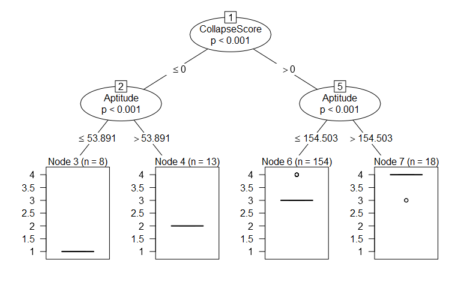

<li>
In the space below, describe how well your model performs.
</li>

<br>

<font color="blue"> Whenever a <font color="black"> `CollapseScore`
</font> is less than or equal to zero, it is classified as unacceptable
or unsatisfactory performance. Thus, under this umbrella category,
aptitude scores less than or equal to 53.89 (level 1) exhibit no error
(third node), where *n* = 8. Aptitude scores greater than 53.89066
(level 2) exhibit no error, where *n* = 13. </font>

<font color="blue"> Whenever a <font color="black"> `CollapseScore`
</font> is greater than 0, employee performance is classified as
acceptable or satisfactory. Under this umbrella category, aptitude
scores less than or equal to 154.50 reach a node level of 3.052, with an
error of 7.6, where *n* = 154 observations. Aptitude scores greater than
154.50 reach a higher node level of 3.89, where there are *n* = 18
observations, and a lower error rate of 1.8. </font>

<font color="blue"> There are three inner nodes and four terminal nodes,
with a correct classification of data points at approximately 11%. The
performance is low, and this model warrants iterative refinement.
</font>

</ol>

## Part Four

### Applying SVM to a Data Set

In this part of the project, you will apply SVM to a data set. The
RStudio instance contains the file `acquisitionacceptanceSVM.csv`, which
includes information about whether or not homeowners accepted a
government offer to purchase their home.

<ol start="1">
<li>
Apply the tool SVM to the acquisition data set in the CSV file
`acquisitionacceptanceSVM.csv` to predict which homeowners will most
likely accept the government’s offer. What variables did you choose to
use in your analysis?
</li>

<br>

``` r
acquisition <- read.csv('acquisitionacceptanceSVM.csv') # read in the dataset

# inspect the dataframe
pandoc.table(head(acquisition), style = 'simple') 
```

| Distance | Floodplain | HomeTenure | Education345 | CurMarketValue | After |
|:--------:|:----------:|:----------:|:------------:|:--------------:|:-----:|
|  162.8   |     1      |     1      |      1       |     650000     |   0   |
|  108.3   |     1      |     14     |      0       |     30000      |   0   |
|   4.55   |     1      |     19     |      1       |     50000      |   0   |
|  81.28   |     1      |     37     |      1       |     78000      |   0   |
|  183.2   |     1      |     9      |      1       |     127300     |   0   |
|  32.05   |     1      |     57     |      0       |     35000      |   0   |

Table continues below

| Price100 | Price75 | Price90 | Price110 | Price125 | Accept |
|:--------:|:-------:|:-------:|:--------:|:--------:|:------:|
|    1     |    0    |    0    |    0     |    0     |   0    |
|    1     |    0    |    0    |    0     |    0     |   0    |
|    1     |    0    |    0    |    0     |    0     |   0    |
|    1     |    0    |    0    |    0     |    0     |   1    |
|    1     |    0    |    0    |    0     |    0     |   0    |
|    1     |    0    |    0    |    0     |    0     |   1    |

``` r
str(acquisition) # obtain the structure of the dataframe
```

    ## 'data.frame':    1531 obs. of  12 variables:
    ##  $ Distance      : num  162.75 108.26 4.55 81.28 183.21 ...
    ##  $ Floodplain    : int  1 1 1 1 1 1 1 1 1 1 ...
    ##  $ HomeTenure    : int  1 14 19 37 9 57 11 65 1 25 ...
    ##  $ Education345  : int  1 0 1 1 1 0 0 0 1 1 ...
    ##  $ CurMarketValue: int  650000 30000 50000 78000 127300 35000 400000 80000 360000 300000 ...
    ##  $ After         : int  0 0 0 0 0 0 0 0 0 0 ...
    ##  $ Price100      : int  1 1 1 1 1 1 1 1 1 1 ...
    ##  $ Price75       : int  0 0 0 0 0 0 0 0 0 0 ...
    ##  $ Price90       : int  0 0 0 0 0 0 0 0 0 0 ...
    ##  $ Price110      : int  0 0 0 0 0 0 0 0 0 0 ...
    ##  $ Price125      : int  0 0 0 0 0 0 0 0 0 0 ...
    ##  $ Accept        : int  0 0 0 1 0 1 0 0 0 0 ...

``` r
nearzerohist(acquisition[c(-12)], x = 4, y = 3)
```

    ## [1] "There are no near-zero variance predictors."

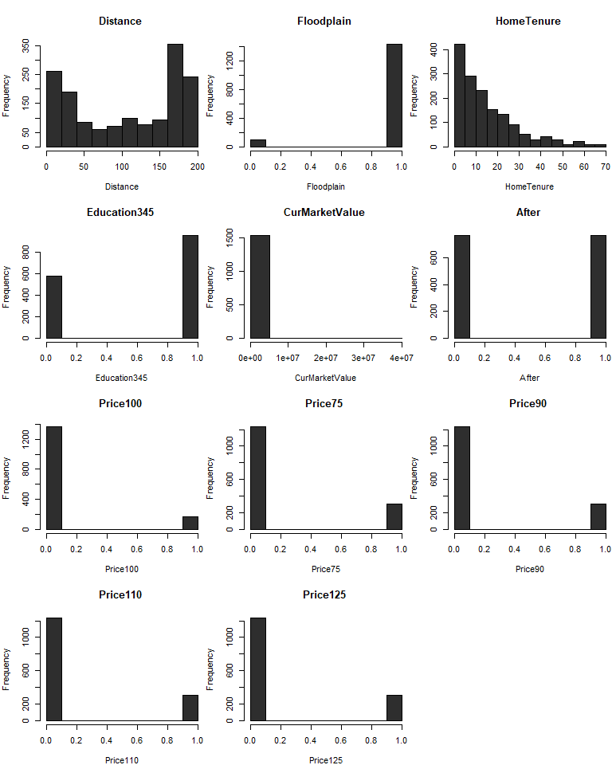
<font color="blue"> Inspecting the dataframe for near zero variance
predictors from a visual standpoint alone identifies current market
value <font color="black"> `CurMarketValue` </font> to be a variable
that exhibits such behavior. However, the <font color = "black">
`nearZeroVar` </font> function from the <font color="black"> `caret`
</font> library does not expose such variables. Near zero variance
measures the fraction of unique values in the columns across the
dataset. </font>

<font color="blue"> Moreover, the correlation matrix does not expose any
sources of high between-predictor relationships (beyond the cutoff point
of *r* = 0.75). This relegates the variable selection process to
Principal Component Analysis (PCA), but this is a dimensionality
reduction technique; there are only 12 variables and 1,531 rows of data.
</font>

``` r
par(mfrow = c(1, 1)) # fix plotting space from prior graph
multicollinearity(acquisition)
```

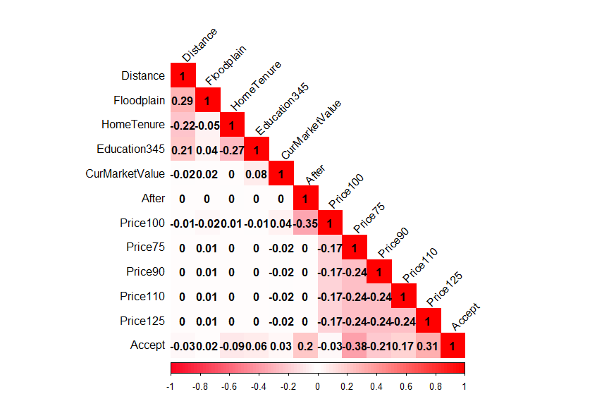

    ##  The following variables should be omitted: 
    ## 

<font color="blue"> Casting the target <font color="black"> `Accept`
</font> variable to a factor is done to categorize the data. There are
enough rows in this dataset to carry out a train-test split, and so it
is done, with 70% partitioned into the training set, and the remaining
30% into the test set. </font>

``` r
acquisition$Accept <- as.factor(acquisition$Accept)
acquisition$Accept <- ifelse(acquisition$Accept == 1, 'Accept', 'Not Accept')
acquisition$Accept <- as.factor(acquisition$Accept) 
```

``` r
set.seed(222) # set seed for reproducibility

# Use 70% of dataset as training set and remaining 30% as testing set
sample <- sample(c(TRUE, FALSE), nrow(acquisition), replace = TRUE, 
                 prob = c(0.7, 0.3))
train_acquisition <- acquisition[sample, ] # training set
test_acquisition <- acquisition[!sample, ] # test set

cat(' Training Dimensions:', dim(train_acquisition),
    '\n Testing Dimensions:', dim(test_acquisition), '\n',
    '\n Training Dimensions Percentage:', round(nrow(train_acquisition) /
                                                nrow(acquisition), 2),
    '\n Testing Dimensions Percentage:', round(nrow(test_acquisition) /
                                               nrow(acquisition), 2))
```

    ##  Training Dimensions: 1067 12 
    ##  Testing Dimensions: 464 12 
    ##  
    ##  Training Dimensions Percentage: 0.7 
    ##  Testing Dimensions Percentage: 0.3

``` r
predictors <- train_acquisition[, c(-12)] # extract ind. var. from train set
target <- train_acquisition[, c(12)] # extract dep. var. from train set
target <- as.factor(target) # cast target as factor
```

<font color="blue"> Since the <font color="black"> `e1071` </black>
package does not allow for a printout of variable importance
(<font color="black"> `varImpt()` </font>) for feature selection, the
<font color="black"> `caret` </font> package is used to accomplish this
task, and the results are shown below. </font> </font>

``` r
# Support Vector Machines via caret
model_svm  <- train(predictors, target, method = 'svmLinear', verbose = FALSE)

# plot the variable importance
svm_varimp <- varImp(object = model_svm)
ggplot2::ggplot(varImp(object = model_svm)) + 
  ggtitle('SVM - Variable Importance') + 
  scale_y_continuous(expand=c(0,0)) +
  theme_classic() +
  theme(plot.margin = unit(c(0,1,0,0), "cm")) +
  theme(axis.text=element_text(color="black"),
        axis.title=element_text(color="black"))
```

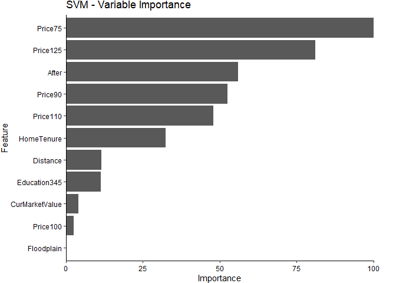
<font color="blue"> The model’s cost and kernel hyperparameters are
tuned over the training data with a 10-fold cross validation sampling
method. The optimal hyperparameter values are shown in table below.
<font color="black"> `Price75` </font> and <font color="black">
`Price125` </font> are the top two variables surpassing a score of 80 in
importance and are thus selected for the soft-margin support vector
machine. </font> </font>

``` r
train_df <- train_acquisition[, c(8, 11, 12)]
test_df <- test_acquisition[, c(8, 11, 12)]

# column names of df to confirm cols
pandoc.table(colnames(train_df), type = 'simple') 
```

|         |          |        |
|:-------:|:--------:|:------:|
| Price75 | Price125 | Accept |

``` r
# tune the support vector machine, optimizing the hyperparameters
# of gamma, cost, and epsilon
set.seed (222) # set seed for reproducibility
tune.out <- tune(svm, Accept ~ Price75 + Price125, data = train_df, 
                 ranges = list(cost = 10 ^ seq(-3, 3), 
                               kernel = c('linear', 'polynomial', 
                                          'radial')))

bestparam <- tune.out$best.parameters # best hyperparamaters
bestmod <- tune.out$best.model # best model based on tuning parameters
bestparam  # print out the best hyperparamaters
```

    ##   cost kernel
    ## 2 0.01 linear

``` r
summary(tune.out)
```

    ## 
    ## Parameter tuning of 'svm':
    ## 
    ## - sampling method: 10-fold cross validation 
    ## 
    ## - best parameters:
    ##  cost kernel
    ##  0.01 linear
    ## 
    ## - best performance: 0.368286 
    ## 
    ## - Detailed performance results:
    ##     cost     kernel     error dispersion
    ## 1  1e-03     linear 0.3683830 0.05519801
    ## 2  1e-02     linear 0.3682860 0.02805209
    ## 3  1e-01     linear 0.3682860 0.02805209
    ## 4  1e+00     linear 0.3682860 0.02805209
    ## 5  1e+01     linear 0.3682860 0.02805209
    ## 6  1e+02     linear 0.3682860 0.02805209
    ## 7  1e+03     linear 0.3682860 0.02805209
    ## 8  1e-03 polynomial 0.3721213 0.05032976
    ## 9  1e-02 polynomial 0.3682860 0.02805209
    ## 10 1e-01 polynomial 0.3682860 0.02805209
    ## 11 1e+00 polynomial 0.3682860 0.02805209
    ## 12 1e+01 polynomial 0.3682860 0.02805209
    ## 13 1e+02 polynomial 0.3682860 0.02805209
    ## 14 1e+03 polynomial 0.3682860 0.02805209
    ## 15 1e-03     radial 0.4902310 0.04622218
    ## 16 1e-02     radial 0.3682860 0.02805209
    ## 17 1e-01     radial 0.3682860 0.02805209
    ## 18 1e+00     radial 0.3682860 0.02805209
    ## 19 1e+01     radial 0.3682860 0.02805209
    ## 20 1e+02     radial 0.3682860 0.02805209
    ## 21 1e+03     radial 0.3682860 0.02805209

<font color="blue"> These hyperparameters are used to create a soft
margin support vector machine. </font>

``` r
# Construct Soft Margin SVM
acquisition_result <- svm(Accept ~ Price125 + Price75, kernel = 'linear', 
                          gamma = 0.001, cost = 0.01, epsilon = 0, 
                          data = train_df, decision.values = TRUE)
print(acquisition_result)
```

    ## 
    ## Call:
    ## svm(formula = Accept ~ Price125 + Price75, data = train_df, kernel = "linear", 
    ##     gamma = 0.001, cost = 0.01, epsilon = 0, decision.values = TRUE)
    ## 
    ## 
    ## Parameters:
    ##    SVM-Type:  C-classification 
    ##  SVM-Kernel:  linear 
    ##        cost:  0.01 
    ## 
    ## Number of Support Vectors:  802

<font color="blue"> The classification results are visualized below.
</font>

``` r
# Visualize the SVM decision boundary using only the training data using price75
# and price125 as features
plot(acquisition_result, data = train_df)
```

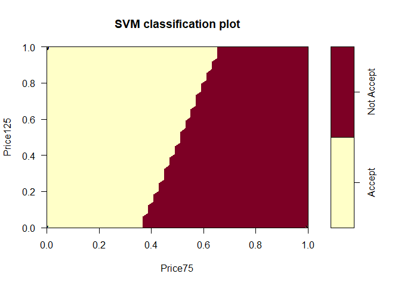

``` r
# create function for outputting a confusion matrix in a pandoc-style format
# where inputs --> df1: model df
#                  df2: dataset
#                  feat: target column
#                  x: H0  column (i.e., 'yes', 'accept' '1', etc.)
#                  y: H1  column (i.e., 'no', 'not accept', '0', etc.)
#                  custom_name: any string you want to pass into table name
      
conf_matrix <- function (df1, df2, feat, x, y, custom_name) {
  
    prediction <- predict(df1, newdata = df2)
    # Evaluate the model on the training data and inspect first six rows
    pred_table <- table(prediction, feat)
    # print out pander-style table with performance results
    metrics <- c(x, y)
    h0 <- c(pred_table[1], pred_table[2])
    h1 <- c(pred_table[3], pred_table[4])
    # create table as dataframe from above variables
    table <- data.frame(metrics, h0, h1)
    # change column names of table
    colnames(table) <- c('\n', x, y)
    table %>% pander(style = 'simple', justify = c('center'),
                     caption = sprintf('Confusion Matrix for %s', 
                                                       custom_name))

}
```

``` r
conf_matrix(df1 = acquisition_result, df2 = train_df, feat = train_df$Accept, 
             x = 'Accept', y = 'Not Accept', custom_name = 'Train Set')
```

|            | Accept | Not Accept |
|------------|:------:|:----------:|
| Accept     |  498   |    350     |
| Not Accept |   25   |    194     |

Confusion Matrix for Train Set

``` r
conf_matrix(df1 = acquisition_result, df2 = test_df, feat = test_df$Accept, 
             x = 'Accept', y = 'Not Accept', custom_name = 'Test Set')
```

|            | Accept | Not Accept |
|------------|:------:|:----------:|
| Accept     |  233   |    150     |
| Not Accept |   11   |     70     |

Confusion Matrix for Test Set

<font color="blue"> The confusion matrix is used to obtain the first
effective measure of model performance (accuracy) using the following
equation. </font>

$$\text{Accuracy} = \frac{\text{TP} + \text{TN}}{\text{TP}+\text{TN}+\text{FP}+\text{FN}}$$
<font color="blue"> Precision (specificity) measures out of everyone who
accepted a government offer to purchase their home, how many actually
accepted? It is calculated as follows. </font>

$$\text{Precision} = \frac{\text{TP}}{\text{TP}+\text{FP}}$$ **Recall
(sensitivity) measures the true positive rate (TPR), which is the number
of correct predictions in the <font color="black"> `Accept` </font>
class divided by the total number of <font color="black"> `Accept`
</font> instances. It is calculated as follows:**

$$\text{Recall} = \frac{\text{TP}}{\text{TP}+\text{FN}}$$ **The
*f1*-score is the harmonic mean of precision and recall, and is
calculated as follows:** <br>

$$f1 = \frac{\text{TP}}{\text{TP}+\frac{1}{2}\text{(FP+FN)}}$$

``` r
# 
#
#
#
# create function for calculating model performance metrics that takes in the 
# following inputs --> df1: model df
#                      df2: dataset
#                      feat: target column
#                      custom_name: any string you want to pass into table name
#

perf_metrics <- function(df1, df2, feat, custom_name) {
  
   prediction <- predict(df1, newdata = df2)
   # Evaluate the model on the training data and inspect first six rows
   df <- table(prediction, feat)  
  
   tp <- df[1] # position of true positives
   tn <- df[4] # position of true negatives
   fp <- df[3] # position of false positives
   fn <- df[2] # position of false negatives
  
   # calculate model performance metrics
   accuracy <- round((tp + tn)/(tp + tn + fp + fn),2) # calculate accuracy
   spec <- round((tp) / (tp + fp),2) # calculate specificity (precision)
   sens <- round((tp) / (tp + fn),2) # calculate sensitivity (recall)
   f1 <- round((tp) / (tp+0.5*(fp+fn)),2) # calculate f1-score

   # print out pander-style table with performance results
   metrics <- c('Accuracy', 'Specificity', 'Sensitivity', 'F1-Score')
   values <- c(accuracy, spec, sens, f1)
   table <- data.frame(Metric = metrics, Value = values)
   table %>% pander(style = 'simple', justify = c('center'),
                    caption = sprintf('Performance Metrics for %s', custom_name))
  
}
```

``` r
# call the `perf_metrics` function to establish performance metrics for train set
perf_metrics(df1 = acquisition_result, df2 = train_df, feat = train_df$Accept,
             custom_name = 'Training Set')
```

|   Metric    | Value |
|:-----------:|:-----:|
|  Accuracy   | 0.65  |
| Specificity | 0.59  |
| Sensitivity | 0.95  |
|  F1-Score   | 0.73  |

Performance Metrics for Training Set

``` r
# call the `perf_metrics` function to establish performance metrics for test set
perf_metrics(df1 = acquisition_result, df2 = test_df, feat = test_df$Accept, 
             custom_name = 'Test Set')
```

|   Metric    | Value |
|:-----------:|:-----:|
|  Accuracy   | 0.65  |
| Specificity | 0.61  |
| Sensitivity | 0.95  |
|  F1-Score   | 0.74  |

Performance Metrics for Test Set  

<li>
How good was your model at correctly predicting who would and who would
not accept the offer?
</li>

<br> <font color="blue"> Using the test data (30% hold out), the model’s
accuracy is only 15% improvement above baseline, coming out to 65%.
However, the model’s ability to correctly classify the
<font color="black"> `Accept` </font> class is effectively high at 95%
specificity. The ROC Curve calculates an AUC (area under the curve)
score of \~64%, so model performance is quite low. Moreover, the ROC
Curve below shows that as the true positive rate increases, so does the
false positive rate, so, for every increase in the false positive rate,
there is a greater increase in false alarms. </font>

``` r
test_prob  <- predict(acquisition_result, test_df, type = 'decision')
pr <-prediction(as.numeric(test_prob), as.numeric(test_df$Accept))
prf <- performance(pr, measure = 'tpr', x.measure = 'fpr')
test_roc <- roc(test_df$Accept ~ as.numeric(test_prob), print.auc = TRUE)
```

    ## Setting levels: control = Accept, case = Not Accept

    ## Setting direction: controls < cases

``` r
auc <- round(as.numeric(test_roc$auc), 2); par(mar = c (4, 4, 2, 1)) 
plot(prf, main = 'SVM ROC Curve', col = 'red', xlab = 'False Positive Rate',
                                               ylab = 'True Positive Rate')
abline(0, 1, col = 'black', lty = 2, lwd = 1)
legend(0.73, 0.2, legend = paste('AUC =', rev(auc)), lty = c(1), col = c('red'))
```

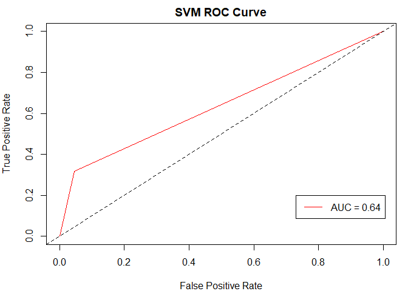

<li>
When building models, we often use part of the data to estimate the
model and use the remainder for prediction. Why do we do this? It is not
necessary to do this for each of the problems above. It is essential to
realize that you will need to do this in practice.
</li>

<br> <font color="blue"> We are interested in seeing how the model
performs on unseen data. Thus, we partition the data into a train-test
split. Ideally, there are enough rows of data to conduct a three-way
train-validation-test split such that the train-validation set becomes
the development set. However, we are working with a smaller amount of
data, so we are using a two-way split, where the training set
(development set) is the larger portion of data (70-80%), and the
remaining 30% is allocated to the test set. Anything can be done
repeatedly to the development set (e.g., iteration,
hyperparameterization, experimentation, etc.), as long as the test set
remains uncontaminated (unseen). Once the model is finalized through the
training set, it can be predicted on the remaining test set. </font>
